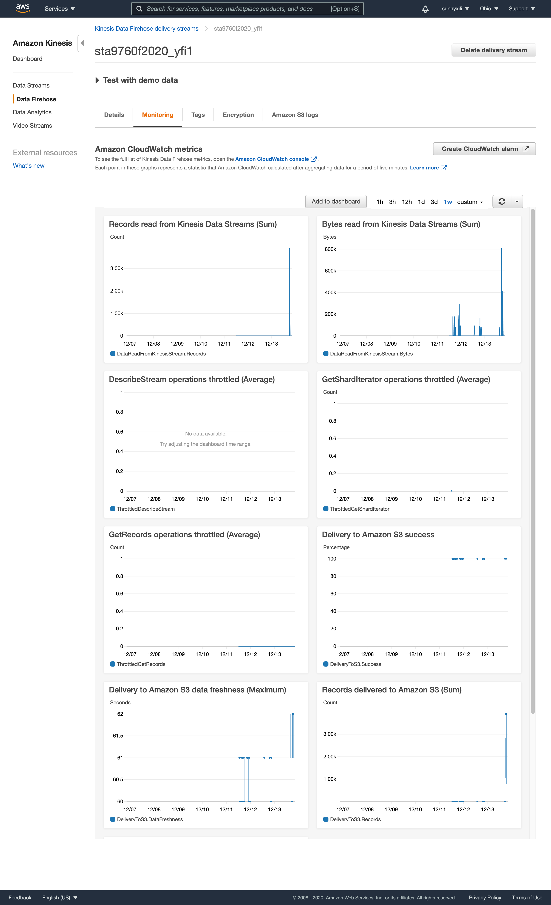
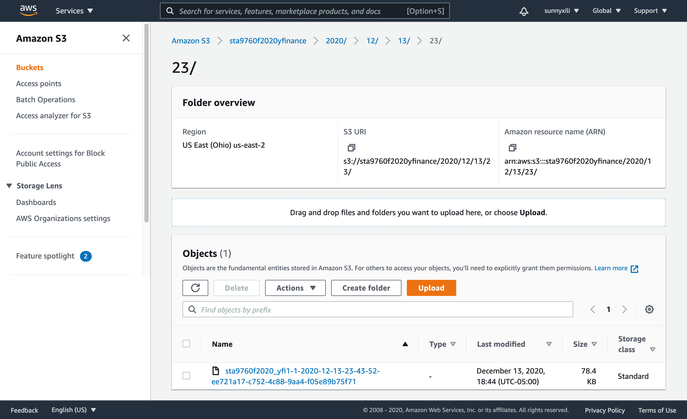

## Streaming Finance Data with AWS Lambda

## Context

For this project, I am tasked with provisioning a Lambda function to generate near real time finance data(Facebook (FB), Shopify (SHOP), Beyond Meat (BYND), Netflix (NFLX), Pinterest (PINS), Square (SQ), The Trade Desk (TTD), Okta (OKTA), Snap (SNAP), Datadog (DDOG)) records for interactive querying.

## **This project include three parts**
-   Infrastructure 
-   Data collection  
-   Data analysis

## **Infrastructure**
1.  A lambda function that gathers our data (DataTransformer)
2.  A Kinesis stream that holds our data (DataCollector)  
3.  A serverless process that allows us to query our S3 data (DataAnalyzer)

## Lambda Code

'''import yfinance
import json
import boto3
import os
import subprocess
import sys
subprocess.check_call([sys.executable, "-m", "pip", "install", "--target", "/tmp", 'yfinance'])
sys.path.append('/tmp')
import random
import datetime
kinesis=boto3.client('kinesis','us-east-2')
import yfinance as yf
def lambda_handler(event,context):
    ticker=['FB','SHOP','BYND','NFLX','PINS','SQ','TTD','OKTA','SNAP','DDOG']
    ticker_download = yf.download(tickers=' '.join(ticker), start="2020-12-01", end="2020-12-02", interval = "5m",period="1d",group_by=["ticker"]) 
    for stock in ticker:
        for index, rows in ticker_download[stock].iterrows():
            data_json=json.dumps({"high": rows.High, 
                                "low": rows.Low, 
                                "ts": str(index), 
                                'name': stock}, 
                                )+"\n"
            kinesis.put_record(                    StreamName='sta9760f2020_yfinance',
                    Data=data_json.encode('utf-8'),
                    PartitionKey='partitionkey')
    return {
            'statusCode': 200,
            'body': json.dumps('Hello from Lambda!')
            }
'''
## Kinesis Data Firehose Delivery Stream Monitoring

## **s3 bucket that shows the file structure and some s3 files in that folder**

